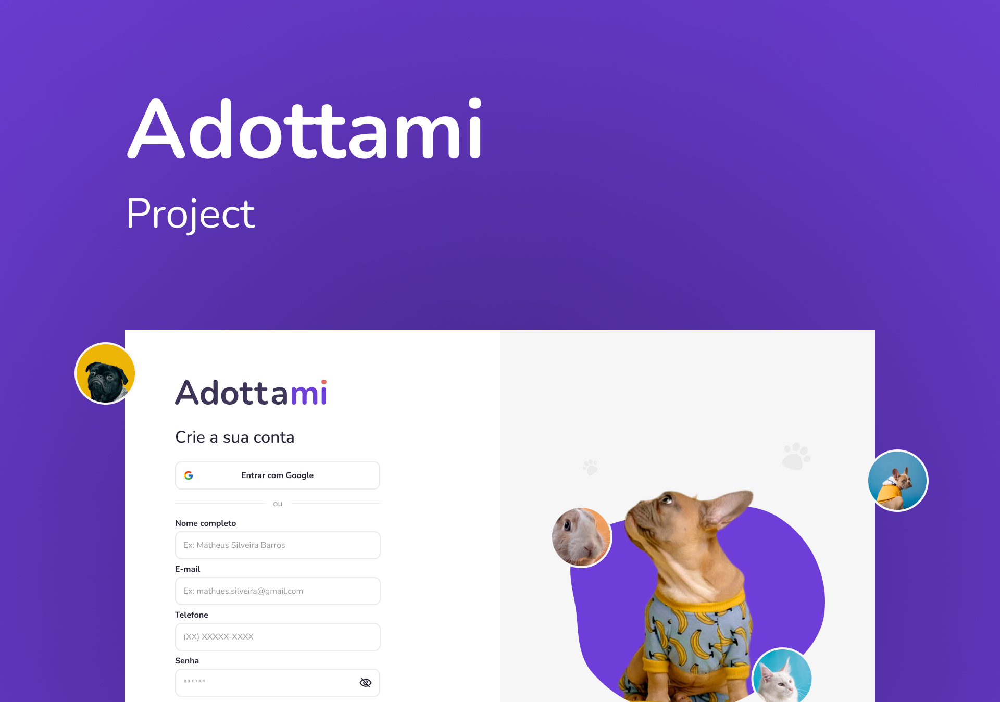

<h1 align="center">Adottami Web</h1>



- [Technologies](#technologies)
- [Installation](#installation)
- [Development guide](#development-guide)
  - [Tests](#tests)
    - [Unit and integration tests](#unit-and-integration-tests)

## Technologies

- [React](https://reactjs.org/), [Next.js](https://nextjs.org/) and [Typescript](https://www.typescriptlang.org/)
- Styling with [Tailwind CSS](https://www.tailwindcss.com)
- Caching and synchronizing application state with [React Query](https://react-query.tanstack.com/)
- Linting with [ESLint](https://eslint.org/)
- Formatting with [Prettier](https://prettier.io/)
- Pre-commit and pre-push Git hooks with [Husky](https://github.com/typicode/husky) and [lint-staged](https://github.com/okonet/lint-staged)
- Testing with [Jest](https://jestjs.io/) and [React Testing Library](https://testing-library.com/docs/react-testing-library/intro)

## Installation

This project runs on [Node.js v16](https://nodejs.org/) and uses [Yarn v1](https://yarnpkg.com/) as dependency manager.

1. Clone the repository and install dependencies:

   ```bash
   $ git clone git@github.com:es-2021-2-grupo-2/adottami-web.git
   $ cd adottami-web
   $ yarn install
   ```

2. To run the project in development mode, run:

   ```bash
   $ yarn dev
   ```

## Development guide

Learn more about the contributing conventions and guidelines at [CONTRIBUTING.md](./CONTRIBUTING.md).

### Tests

The project uses [Jest](https://jestjs.io/) for unit and integration tests.

#### Unit and integration tests

Once you have installed the project dependencies as explained at [Installation](./README.md#installation), run the following command to run the project's unit and integration tests:

```bash
$ yarn test
```

To learn more about the CLI options supported by Jest, access the [documentation](https://jestjs.io/docs/cli).
